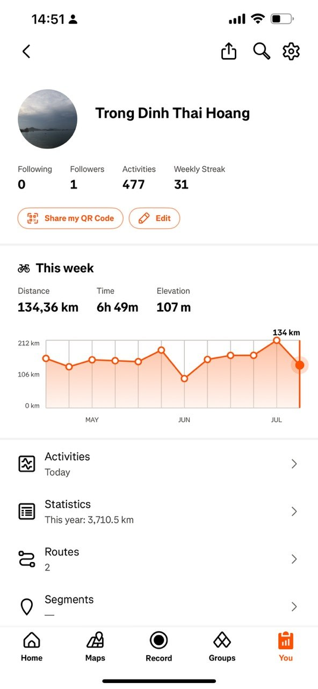

Six months ago, I set goals for 2026. Today I check my progress. Here is what I built, what worked, and what comes next.

## The Big Lesson: Turn Goals Into Systems

This year, I learned one thing. Call it a "personality system." If you want to achieve something, make it part of daily life.

Motivation fades fast. A daily system does not. Arrange your system first, and the results follow on their own.

## The Small Rule: Be Nice, Be Friendly

My second lesson is simple. Always be nice. Always be friendly. Small kindness compounds, just like good habits do.

---

## Achievement 1: I Built My Own OKR Tool

I paid for OrderOKR to track my goals. It was hard to use and full of bugs. So I built my own.

I open-sourced it. It is called **myOKR**. You can check the code here: [github.com/trongdth/myOKR](https://github.com/trongdth/myOKR)

**Status: Shipped and open source**
```
██████████ 100%
```

## Achievement 2: Work Focus, One Pomodoro at a Time

I hit **20 pomodoros a week** for focused work. It is a solid, repeatable habit now.

Next target: **30 pomodoros a week**. Here is my progress toward that next milestone.

**Progress toward 30/week goal**
```
███████░░░ 67% (20 of 30)
```

## Achievement 3: Mental Health on Two Wheels

My goal was **600 km by bike every month**. Here is the real evidence, straight from my cycling app.



- This year so far: **3,710.5 km**
- That is about **588 km per month** on average
- Weekly streak: **31 weeks in a row**, no week skipped

**Progress toward 600 km/month goal**
```
█████████░ 98%
```

Next target: an **Audax 200 km** ride. A single-day, long-distance challenge. A new kind of test.

## Achievement 4: Learning and Growing

I read **2 books**: *Atomic Habits* and *Deep Work*. Both taught me about systems and focus.

**Books read this half**
```
██████████ 100% (2 of 2)
```

I also published **2 articles every month**, for 6 months straight. That is 12 articles, on schedule, no gaps.

**Writing consistency**
```
██████████ 100% (12 of 12)
```

---

## What's Next for the Second Half of 2026

1. Push pomodoros from 20 to **30 per week**
2. Complete my first **Audax 200 km** ride
3. Keep the **2 books, 2 articles a month** pace
4. Keep improving **myOKR**, based on real daily use

## Closing Thought

A system, not motivation, got me here. Be nice, be friendly, and let the daily habit do the hard work for you.

See you at the end of 2026.
