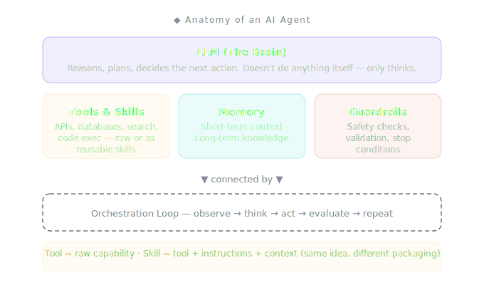
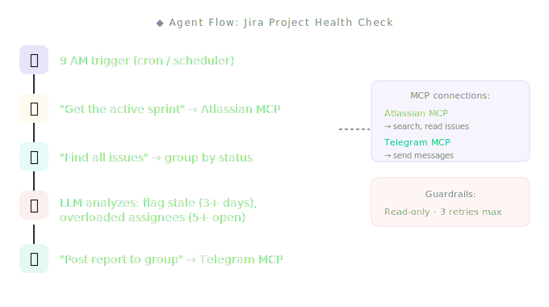

Welcome to **AI First** — a series that takes you from zero to running AI agents. The goal is simple: **understand** the core concepts, **build** your own assistant agent, and **orchestrate** multiple agents working together. We'll use real tools and frameworks along the way, but those are just the means. The destination is the same — you ship agents that actually work.

This first article covers the foundation: what an AI agent actually is, how to think about designing one, and why the fundamentals matter more than whichever framework is trending this week.

## An agent is just 4 things

Strip away the buzzwords — OpenClaw, Hermes, CrewAI, LangGraph — and every AI agent is built from the same four components:



That's it. Seriously. Every agent framework you see — OpenClaw with 346K GitHub stars, Hermes Agent growing like crazy — is just a different way of packaging these four pieces.

Let me break each one down.

### The Brain (LLM)

GPT-4, Claude, Gemini, Llama — any large language model. It reads input, thinks about what to do, and decides the next action. The brain doesn't _do_ anything by itself. It only _decides_. This distinction matters: the LLM is the reasoning engine, not the execution engine.

### Tools & Skills

Tools are how the agent touches the real world. Search the web, read a database, send a message, call an API, execute code. **Without tools, an agent is just a chatbot.** Tools are what make it _act_.

You'll also hear the word **"skill"** a lot — especially in OpenClaw and Multica. A skill is just a **tool packaged with instructions**. Think of it this way:

> **Tool** = a raw capability. "Can search the web."
>
> **Skill** = a tool + context + instructions bundled together. "Search the web for Jira ticket status, format results as a summary table, retry 3 times if API fails."

Same concept, different packaging. A tool is a screwdriver. A skill is a screwdriver + instructions + the right screws for a specific job. Frameworks use different names — OpenClaw calls them "skills," Claude Agent SDK calls them "tools with schemas," CrewAI calls them "tools with descriptions" — but the underlying idea is identical: give the agent a capability and tell it when and how to use it.

### Memory

**Short-term memory** is the current conversation — what's been said so far. **Long-term memory** is stored knowledge that persists across sessions — user preferences, past decisions, learned patterns. Memory is what makes an agent feel like it _knows_ you.

### Guardrails

This is the one most tutorials skip. Guardrails define what the agent _can't_ do: rate limits, budget caps, content filters, human approval gates. An agent without guardrails is a liability.

## The loop is where agents become "smart"

Here's the insight that changed how I think about this:

**Agents aren't smarter than LLMs. They just get more attempts.**

A normal LLM call is one-shot. You ask, it answers. If it's wrong, too bad.

An agent runs in a loop:

```
while task_not_done:
    1. Observe  → what's the current situation?
    2. Think    → LLM decides the next action
    3. Act      → call a tool, store data, or respond
    4. Evaluate → did it work? try again or stop?
```

If step 3 fails — the API returned an error, the search had no results — the agent goes back to step 2 with new information: _"that didn't work, what should I try instead?"_

This loop has a name: **ReAct** (Reasoning + Acting). It's the same pattern in OpenClaw, Hermes, LangGraph — every serious framework. The names differ. The loop is identical.

## Design your agent in 30 minutes: 5 questions

Before you touch any framework or write any code, answer these five questions. I'm serious — this saves you _days_ of wasted work.

### Q1: What's the job?

Write it like you're hiring a junior employee. Not "help with project management" but:

> "Connect to our Jira board, fetch all tickets for the current sprint, group them by status and assignee, calculate how many are overdue, and send me a daily health report in our Telegram engineering group."

If you can't write this in 2-3 sentences, your scope is too broad. Split it into two agents.

### Q2: What tools does it need?

List every external capability your agent needs. But here's the thing most tutorials get wrong: in modern agent frameworks, **you don't write tool functions from scratch**. You connect to existing **MCP servers** (Model Context Protocol) — pre-built bridges that give your agent access to external services through natural language.

For the Jira health agent, you need two connections:

- **Atlassian MCP server** → search issues, read sprint data, get ticket details
- **Telegram MCP server** → send messages to groups and channels

That's it. You don't call `fetch_sprint_issues()` — you tell the agent _"get all issues in the active sprint"_ and the MCP server translates that into the right API calls. The agent talks in natural language, the MCP server handles the plumbing.

**My rule: start with 2-3 MCP connections maximum.** Every connection you add increases complexity.

### Q3: What does it remember?

For most first agents: **nothing beyond the current conversation.** Long-term memory is powerful but adds massive complexity. Skip it for v1. Add it later.

### Q4: When does it stop?

Define explicit exit conditions. Report generated → stop. Tried 5 times to reach Jira API → stop and report failure. Encountered permissions error → stop and escalate.

I once forgot this step. The agent looped for 47 iterations trying to "perfect" a response. That API bill was a good teacher.

### Q5: What can go wrong?

Jira API is down → retry 3 times, then notify the team. LLM misreads a ticket status → validate against Jira's status enum before reporting. Sprint has no tickets → return "empty sprint" instead of crashing.

## Real example: a Jira project health agent

Let me walk through a concrete design. Say your engineering team uses Jira, and every Monday morning someone manually checks: how's the sprint going? How many tickets are stuck? Who's overloaded? That person is about to become an agent.

**The job:** Connect to Jira every morning at 9 AM. Fetch all issues in the active sprint. Group by status (To Do, In Progress, In Review, Done). Flag tickets that haven't moved in 3+ days. Flag assignees with more than 5 open tickets. Send a health report to the engineering Telegram group.

Here's the design on paper:

**Tools:** In practice, you don't build these from scratch. You connect existing **MCP servers** — pre-built tool packages that give the agent access to external services:

```
Atlassian MCP server  →  fetch sprints, search issues, read ticket details
Telegram MCP server   →  send messages to groups and channels
LLM (built-in)       →  analyze, group, flag patterns, generate report
```

Two MCP connections + the LLM's built-in reasoning. That's the entire toolset. No custom code needed — the MCP servers expose Jira and Telegram as tools the agent can call through natural language.

**Memory:** Short-term only — the current sprint data being analyzed.

**Guardrails:** Read-only access to Jira (never modify tickets). Maximum 3 API retries. Never expose individual performance publicly — only flag patterns like "3 tickets haven't moved." All defined in a `CLAUDE.md` instruction file.

**Stop when:** Report is sent to Telegram, or all retries exhausted.



The report the agent sends to Telegram might look like:

```
🏥 Sprint "Q2-W3" Health Report

Status breakdown:
  To Do:        4 tickets
  In Progress:  7 tickets
  In Review:    3 tickets
  Done:         12 tickets (46% complete)

⚠️ Flags:
  → 2 tickets haven't moved in 3+ days
    • PROJ-142: "API rate limiting" (In Progress, 5 days)
    • PROJ-158: "Fix login flow" (In Review, 4 days)
  → 1 assignee has 6 open tickets (above threshold)

Overall: Sprint is on track but needs attention
         on stale items before Thursday.
```

Two MCP servers. Single purpose. Clear boundaries. Read-only. Zero lines of code — just a `CLAUDE.md` instruction file and a `.mcp.json` config.

And that's the point — **a well-designed agent is boring.** The design doc is more important than the code. In fact, with MCP and scheduled tasks, you might not write any code at all.

## The gap nobody talks about

After designing this agent on paper, the next step is... code. A lot of it.

You need to pick a framework. Set up the LLM connection. Define tool schemas. Handle Jira OAuth. Write error handling. Configure the scheduler. Set up deployment. Build monitoring so you know if the agent silently breaks at 3 AM on a Saturday.

For an experienced engineer, that's a weekend project. But even for engineers, the landscape is overwhelming: Claude Agent SDK? LangGraph? CrewAI? Google ADK? OpenAI Agents SDK? Each has its own abstractions, its own terminology, its own way of defining tools. **The paradox of choice is real.**

And for non-engineers — the project manager who actually _does_ the manual sprint health check every Monday — it's a wall. They know exactly what agent they want. They just can't build it.

**The gap isn't knowledge. It's tooling.**

We have incredible AI models. We have powerful frameworks. But we don't yet have a simple way for people to go from _"I want an agent that does X"_ to a running agent — without getting lost in the framework jungle.

That's a problem worth solving. And it starts with understanding the fundamentals — which is exactly what this article is for.
