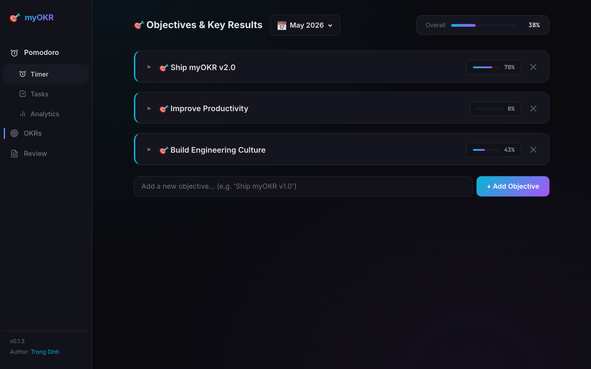
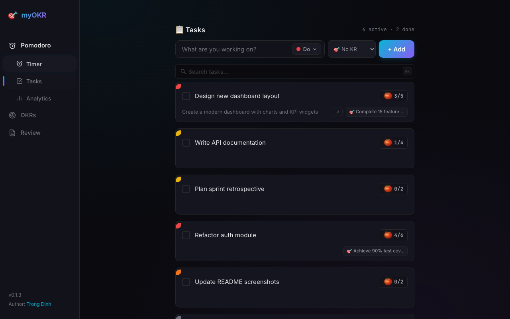
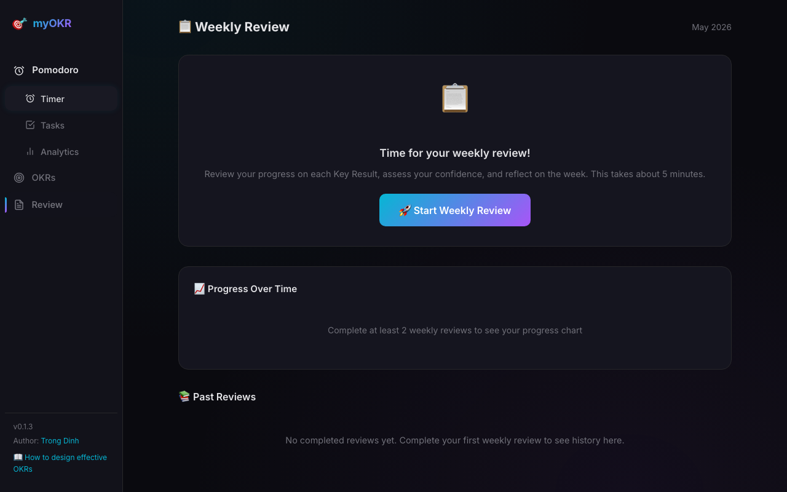

Most OKR advice was written for quarterly planning at big companies. It
doesn't fit a single person trying to grow on a monthly cadence, with focus
time and weekly reviews baked in.

This is the system I run inside [myOKR](https://github.com/trongdth/myOKR) —
the desktop app I built — and it borrows three ideas from _Atomic Habits_
that I think most OKR templates miss.

---

## The system in one paragraph

Pick **three** objectives a month, one in each life zone: **work**, **mental
health**, **learning & growth**. Break each one into **small, easy-to-hit Key
Results** — not stretch goals. Treat the **Weekly Review** as a reward
ritual: celebrate every KR you closed. Repeat next month.

That's it. The rest of this post shows why each piece matters, then how to
set it up in myOKR.

---

## Why three zones

Work-only OKRs are why most personal OKR experiments die in week three. You
hit a rough patch at work, miss your targets, and the whole system feels
like a verdict. Splitting across three zones gives you a portfolio:

- **Work** — the thing you get paid for, or your main project.
- **Mental health** — sleep, exercise, time outdoors, therapy, anything
  that compounds your baseline.
- **Learning & growth** — a skill, a book, a side project. The thing
  future-you will thank present-you for.

Even a bad work month still produces wins in the other two zones. The
system stays alive.

## Why Key Results should be small

Classic OKRs say _"set ambitious targets you'd be happy hitting 70% of."_
For a solo monthly cycle, that's a recipe for burnout. _Atomic Habits_
makes the case the other way: **make the action so small you can't say no**.

A KR like _"publish 1 blog post"_ beats _"publish 4 blog posts"_ every
single month, because the first one actually ships. Once the habit is in,
you raise the bar next cycle.

myOKR lets you classify a KR by how it's measured — **focus hours**,
**pomodoros**, **completed tasks**, or manual. Pick the smallest unit that
still represents real progress.

## Why a reward matters

A habit loop is **cue → craving → response → reward**. OKR systems usually
nail the first three and skip the reward. So the brain stops bothering.

I treat the **Weekly Review** as the reward step. Confidence stayed green
all week? That's the cue to do something nice — close the laptop early, buy
the book, take the walk. The Review page is where the loop closes.

---

## How to run it in myOKR

### 1. Create an OKR with Key Results

Open the **OKRs** tab. Add one objective per zone, then break each into 2-3
small KRs. Set each KR's completion mode (focus hours / pomodoros / tasks)
so progress can update itself.

### 2. Create a Task and link it to a KR

In the **Tasks** tab, create the concrete work that moves a KR forward.
Use the dropdown to link the task to its parent KR. From here on, every
pomodoro you complete on that task automatically ticks the KR — no manual
logging.

### 3. Run a Weekly Review (and reward yourself)

Every Sunday, open the **Review** tab. The wizard pre-fills your progress
from the week's pomodoro data, so you only have to set confidence
(🟢 / 🟡 / 🔴) and write a one-line reflection. Then — and this is the
important part — **pick a reward** for any KR you closed.

That tiny ritual is what keeps the system running past month three.

---

## TL;DR

1. Three objectives, one per zone (work / mental / learning).
2. KRs small enough you can't fail.
3. Reward yourself in the Weekly Review.

The app is free and local-first: [github.com/trongdth/myOKR](https://github.com/trongdth/myOKR).
