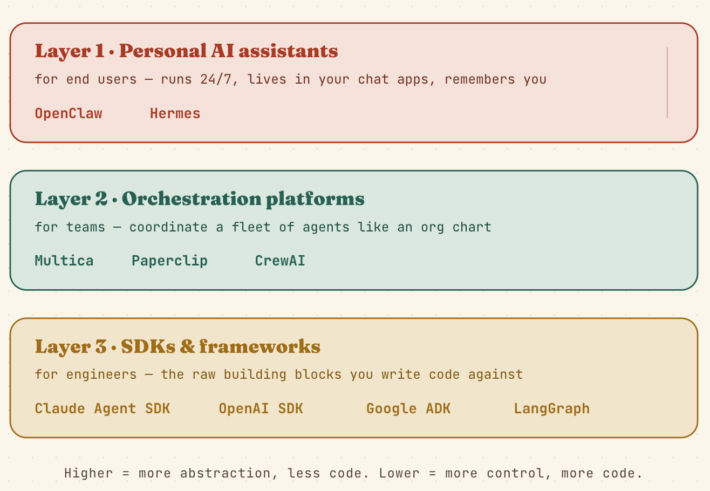

If you're diving into the world of AI agents, you’ve probably noticed an overwhelming number of tools—LangGraph, CrewAI, AutoGPT, Claude SDK, and more. They all sound like they do the same thing, but they don't. (If you aren't quite sure what an AI agent is yet, I recommend reading [AI First: What Is an AI Agent?](/blog/ai-first-what-is-an-ai-agent/) before continuing here.)

Before we jump in, a quick clarification: you might hear that the layers are based on "user experiments," but it's actually a bit simpler than that! The layers are based on **user experience and technical expertise**. They are categorized by *who* the tool is built for.

As you move down the layers, you trade simple abstractions for complete control. Let's break down the three tiers of agent development, the tools you can use, and how to actually run them.

---

## Layer 1: Personal AI Assistants (For End Users)

**Who it's for:** Non-technical users who want an out-of-the-box solution.
**The experience:** You don't write any code. You just talk to the agent. It runs 24/7, remembers your preferences, and handles tasks in the background.

At this layer, the focus is entirely on utility and ease of use. You aren't building the underlying logic; you are just steering the AI with natural language.

**Popular Tools in this Layer:**
*   **ChatGPT Plus / Claude Pro / Gemini Advanced:** The classic chat interfaces.
*   **OpenClaw & Hermes:** Always-on personal assistants that integrate deeply with your daily apps.
*   **Apple Intelligence / Windows Copilot:** OS-level agents that do things on your behalf.

*Note: There's no code to run here because the entire point of Layer 1 is that the platform handles the execution for you.*

---

## Layer 2: Orchestration Platforms (For Teams & Power Users)

**Who it's for:** Project managers, power users, and teams who need multiple agents working together.
**The experience:** You act as a manager. You define roles, assign goals, and watch as a "fleet" of agents collaborate to get the job done. 

The moment you need more than one agent to solve a problem (e.g., one agent writes code, another tests it, and a third writes documentation), you need orchestration. 

**Popular Tools in this Layer:**
*   **CrewAI:** Framework for orchestrating role-playing autonomous agents.
*   **AutoGPT / BabyAGI:** Autonomous agents that break down big goals into sub-tasks.
*   **ChatDev:** A virtual software company where different agents act as CEO, CTO, and programmers.
*   **Claude Code (CLI):** Sits perfectly here as a power-user terminal tool.
*   **Multica & Paperclip:** Team-based orchestration platforms.

### Runnable Example: CrewAI
Here is a simple, real-world example you can run locally using `crewai` to see orchestration in action. 

*(Prerequisite: `pip install crewai langchain-openai` and set your `OPENAI_API_KEY`)*

```python
from crewai import Agent, Task, Crew
import os

# 1. Define an Agent with a specific role
researcher = Agent(
    role='Senior Tech Researcher',
    goal='Find the latest news about AI Agents',
    backstory='You are an expert AI researcher who loves summarizing complex topics.',
    verbose=True
)

# 2. Define a Task for that agent
task = Task(
    description='Summarize the top 3 benefits of AI agents in 2024.',
    expected_output='A simple 3-bullet point summary.',
    agent=researcher
)

# 3. Create the Crew and run it!
crew = Crew(
    agents=[researcher],
    tasks=[task]
)

result = crew.kickoff()
print("FINAL RESULT:")
print(result)
```

---

## Layer 3: SDKs & Frameworks (For Engineers)

**Who it's for:** Software engineers building custom applications.
**The experience:** You write the code. You build the "agent loop" (think -> act -> observe -> repeat), define the tools, and handle the memory. 

This is the raw machinery. If you want to embed an agent into your own SaaS product or build highly custom internal workflows, this is where you live.

**Popular Tools in this Layer:**
*   **OpenAI SDK / Google Gen AI SDK / Anthropic SDK:** The foundational APIs to call the models.
*   **LangGraph:** A framework by LangChain for building highly controllable, cyclic agent workflows.
*   **Vercel AI SDK:** The go-to for building AI into React/Next.js web apps.
*   **LlamaIndex Agents:** Great for agents that need to dig through massive amounts of custom data (RAG).
*   **AutoGen (Microsoft):** A framework that enables the development of LLM applications using multiple agents that can converse with each other.

### Runnable Example: The Raw Agent Loop
Here is a complete, runnable Python script showing how a Layer 3 agent works under the hood using the standard OpenAI SDK. It teaches the agent how to use a "tool" to get the weather.

*(Prerequisite: `pip install openai` and set your `OPENAI_API_KEY`)*

```python
import openai
import json

client = openai.Client()

# 1. Define a custom tool (a normal Python function)
def get_weather(location):
    # In reality, this would call a weather API
    return f"The weather in {location} is 72°F and sunny."

# 2. Tell the AI about the tool
tools = [{
    "type": "function",
    "function": {
        "name": "get_weather",
        "description": "Get the current weather in a given location",
        "parameters": {
            "type": "object",
            "properties": {"location": {"type": "string"}},
            "required": ["location"],
        },
    }
}]

# 3. The Agent Loop
messages = [{"role": "user", "content": "What's the weather in San Francisco?"}]

# Step A: Ask the AI what to do
response = client.chat.completions.create(
    model="gpt-4o-mini",
    messages=messages,
    tools=tools
)

message = response.choices[0].message

# Step B: If the AI wants to use a tool, run it!
if message.tool_calls:
    tool_call = message.tool_calls[0]
    args = json.loads(tool_call.function.arguments)
    
    print(f"Agent decided to call: {tool_call.function.name} with {args}")
    
    # Run our Python function
    result = get_weather(args["location"])
    
    # Step C: Give the result back to the AI
    messages.append(message) # Append the AI's tool request
    messages.append({
        "role": "tool",
        "tool_call_id": tool_call.id,
        "content": result
    }) # Append the actual tool result
    
    # Step D: Get the final answer
    final_response = client.chat.completions.create(
        model="gpt-4o-mini",
        messages=messages
    )
    print("\nAgent Final Answer:")
    print(final_response.choices[0].message.content)
```

## Summary



The secret to building agents isn't about finding the "best" tool—it's about finding the tool that matches your technical comfort level. End users want Layer 1 assistants. Teams want Layer 2 orchestrators. Engineers want Layer 3 frameworks. Pick your layer, and start building!
